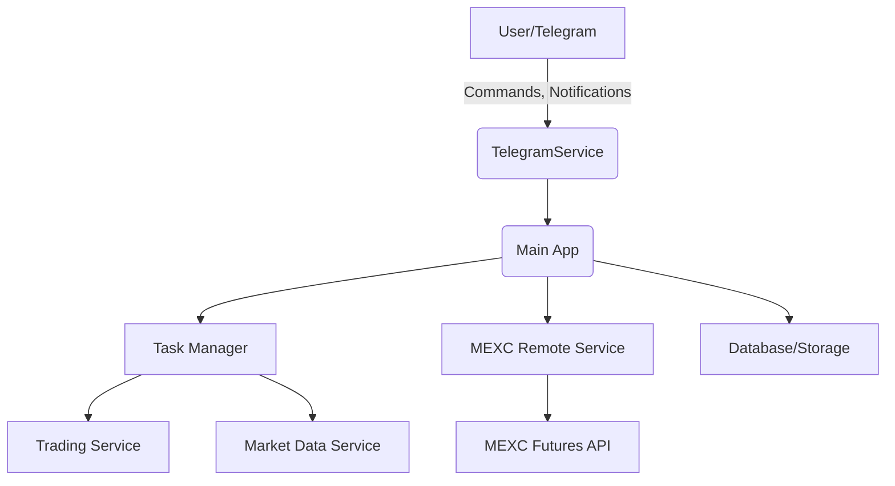

<p align="center">
  <a href="https://github.com/jsoladur/crypto-futures-bot/actions"></a>
  <a href="https://coveralls.io/github/jsoladur/crypto-futures-bot"></a>
  <a href="https://opensource.org/licenses/MIT"></a>
  <br>
  <a href="https://www.python.org/downloads/release/python-3130/"></a>
  <a href="https://github.com/astral-sh/ruff"></a>
  <a href="https://pre-commit.com/"></a>
</p>

# Crypto Futures Bot

A Python-based bot for automated cryptocurrency futures trading, designed to operate against **MEXC Futures**. It features automated trading strategies, Telegram integration for real-time control, and robust portfolio management.

---

## ⚠️ Disclaimer

> **This repository does *not* constitute investment advice.**  
> The creator of this crypto bot is **not responsible** for any financial gains or losses you may experience by using, modifying, or deploying this code. All actions you take based on this project are done **at your own risk**.  
> Cryptocurrency markets, especially futures, are volatile and unpredictable — **use this tool responsibly and with caution.**

---

## Features

### Core Trading Automation
- **Automated Futures Trading**: Execute long and short positions based on market conditions.
- **Stop-Loss & Take-Profit**: Automated risk management to protect capital and secure profits.
- **Signal Detection**: Utilizes technical indicators to identify potential trading opportunities on MEXC Futures.

### User Interaction & Control
- **Interactive Telegram Bot**: Receive real-time notifications, issue commands, and check portfolio status directly from Telegram.
- **Manual Trade Triggers**: Manually initiate trades via the Telegram bot.

### System & Architecture
- **Exchange Integration**: Built for **MEXC Futures** API.
- **Modular Design**: Clean, modular architecture using `dependency-injector` for easy extension.
- **Container Ready**: Docker support for easy deployment.

---

## Architecture Overview



---

## Installation

### Prerequisites
- Python 3.13+
- [uv](https://github.com/astral-sh/uv) (recommended for dependency management)
- Docker (optional, for containerized deployment)

### Clone the repository
```sh
git clone https://github.com/jsoladur/crypto-futures-bot.git
cd crypto-futures-bot
```

### Install dependencies
Using `uv` for fast dependency installation:

```sh
uv sync
```

### Environment Setup
Copy `.env.example` to `.env` and fill in required values:

```sh
cp .env.example .env
```

Edit `.env` with your credentials:
- `TELEGRAM_BOT_TOKEN`: Your Telegram bot token.
- `ROOT_USER` & `ROOT_PASSWORD`: For secure access/dashboard (if applicable).
- **MEXC Credentials**: (Add your API Key and Secret if required by the configuration).

---

## Usage

### Local Development
Run the bot locally using Python:

```sh
python -m crypto_futures_bot.main
```

Or using Taskipy:

```sh
task start
```

### Docker Compose
Build and run with Docker Compose:

```sh
docker-compose up --build
```

---

## Configuration

Configuration is managed via environment variables. See `.env.example` for the base template.

### Core
- `TELEGRAM_BOT_TOKEN`: Token for the Telegram bot.
- `ROOT_USER`: Admin username.
- `ROOT_PASSWORD`: Admin password.

### Exchange (MEXC)
*Ensure you have your MEXC Futures API credentials ready and configured in your environment as needed by the application logic.*

---

## Contributing

Contributions are welcome! Please feel free to submit a Pull Request.

### Development Environment
1. Fork the repository.
2. Create your feature branch (`git checkout -b feature/AmazingFeature`).
3. Commit your changes (`git commit -m 'Add some AmazingFeature'`).
4. Push to the branch (`git push origin feature/AmazingFeature`).
5. Open a Pull Request.

---

## License

Distributed under the MIT License. See `LICENSE` for more information.
